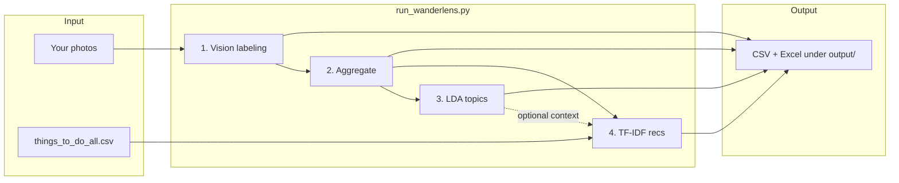

# WanderLens — Travel Photo Recommender

**WanderLens** turns a personal photo album into Texas travel article recommendations. Vision AI tags each photo, the pipeline summarizes your visual preferences, discovers album themes, and ranks Culture Trip–style listings from a curated CSV—no web scraping at recommendation time.

**Single entry point:** [`run_wanderlens.py`](run_wanderlens.py) (portfolio implementation of the original notebook research pipeline).

---

## How it works



| Stage | What it does | API key? | Based on |
|-------|----------------|----------|----------|
| **1. Labeling** | Tags each photo (objects, vibe, indoor/outdoor, category mix) | Yes (vision) | `Photo Tagger.ipynb` |
| **2. Aggregate** | Counts tags per album; averages travel-category scores | No | `Photo Tagger.ipynb` |
| **3. LDA topics** | Finds 2–3 word themes across your album | No | `Final_Project_LDA.ipynb` |
| **4. Recommendations** | Matches album tag profile to listing text (title + category + …) | No | `travel_recommender_code.ipynb` |

**Listings catalog:** [`things_to_do_all.csv`](things_to_do_all.csv) — article titles, categories, and URLs scraped separately. Recommendations use **text from the CSV only** (no hero-image download or `labels_openai` vision step).

---

## Pipeline stages (detail)

### 1. Vision labeling (`--only label` or part of `--only all`)

- Reads images from `--photos` (folder, single file, or parent folder with album subfolders).
- Calls **GPT-4o** (OpenAI or GitHub Models) with a strict JSON schema: 5–12 tags, 8 travel categories (probabilities), and attributes (indoor/outdoor, day/night, season).
- Writes per-photo rows to `{album_file_prefix}_labels_per_photo.csv`.

**Requires:** `OPENAI_API_KEY` or `GITHUB_MODELS_TOKEN`.

### 2. Aggregate (`--only aggregate`)

- Explodes photo tags into `{album_file_prefix}_label_counts.csv` (tag + count per album).
- Computes mean category probabilities → `{album_file_prefix}_category_means_long.csv`.
- Powers the **user profile** used in recommendations.

**Requires:** labeled photos (from step 1 or `--demo` / `--skip-labeling`).

### 3. LDA album topics (`--only topics`)

- Tokenizes and lemmatizes your photo labels, trains a small LDA model per album.
- Outputs `{album_file_prefix}_topics.csv` with top words per theme (e.g. `beach, sunset, ocean`).

**Requires:** at least ~3 successfully labeled photos per album. Uses `nltk` + `gensim` locally.

### 4. TF-IDF recommendations (`--only recs`)

- Builds listing text from each row: **title**, **category**, optional description columns, and light cues from hero-image filenames.
- Builds your profile from `{album_file_prefix}_label_counts.csv` (tags weighted by frequency).
- **TF-IDF** (unigrams + bigrams) + **cosine similarity** → top-N articles with scores, URLs, and overlapping “why” terms.
- Writes `{album_file_prefix}_recommendations.xlsx` and includes recs in `{album_file_prefix}_summary.xlsx`.

**Requires:** aggregate outputs + `things_to_do_all.csv` (default `--items-csv`). **No API key.**

---

## Quick start

```powershell
cd new_run
python -m pip install --upgrade pip
python -m pip install -r requirements.txt
```

Copy [`.env.example`](.env.example) for variable names (do not commit real keys).

**Example with bundled sample photos:**

```powershell
$env:OPENAI_API_KEY = "sk-your-key"
python run_wanderlens.py --provider openai --photos .\sample_images --name "Sample Album"
```

Outputs appear under `output/sample_album/` (`folder_name` / `album_file_prefix` derived from `--name`).

---

## How to run

### OpenAI (paid)

1. Create a key at [platform.openai.com/api-keys](https://platform.openai.com/api-keys).
2. In the **same** terminal session:

```powershell
$env:OPENAI_API_KEY = "sk-your-openai-key"
python run_wanderlens.py --provider openai --photos .\sample_images --name "Sample Album"
```

Default model: `gpt-4o`. Override: `--model gpt-4o`.

### GitHub Models (free, rate-limited)

1. [Personal Access Token](https://github.com/settings/tokens) with **`models`** read access.
2. Model id from [GitHub Models marketplace](https://github.com/marketplace/models) (e.g. `openai/gpt-4o`).

```powershell
$env:GITHUB_MODELS_TOKEN = "ghp_your_pat"
python run_wanderlens.py --provider github --photos .\sample_images --name "Sample Album"
```

Uses the same `openai` Python SDK with base URL `https://models.github.ai/inference`.  
**Do not** put a GitHub PAT in `OPENAI_API_KEY`.

Quick API test:

```powershell
python -c "import os; from openai import OpenAI; c=OpenAI(base_url='https://models.github.ai/inference', api_key=os.environ['GITHUB_MODELS_TOKEN']); r=c.chat.completions.create(model='openai/gpt-4o', messages=[{'role':'user','content':'Say hi in 3 words'}], max_tokens=20); print(r.choices[0].message.content)"
```

Use `--max-photos 5` while testing on the free tier.

### Auto-detect provider

```powershell
# GitHub if only GITHUB_MODELS_TOKEN is set; otherwise OpenAI
python run_wanderlens.py --photos .\sample_images
```

### Demo — no API key (bundled labels)

Runs **aggregate → LDA → recommendations** using teammate sample labels shipped in the repo. No photo folder needed.

```powershell
python run_wanderlens.py --demo
```

Uses bundled `labels_per_photo.csv` (multiple sample albums). If missing in `new_run/`, copy from the parent repo’s `Data/labels_per_photo.csv`. Good for portfolio reviewers who should not supply keys.

### Reuse labels (no second vision run)

After a full labeling run:

```powershell
python run_wanderlens.py --photos .\sample_images --name "Sample Album" --skip-labeling
python run_wanderlens.py --photos .\sample_images --name "Sample Album" --skip-labeling --only recs
```

### Photo input patterns

| Layout | Command |
|--------|---------|
| Flat album (`sample_images/`) | `--photos .\sample_images --name "My Album"` |
| Single image | `--photos .\trip.jpg --name "Summer 2024"` |
| Multiple albums (subfolders) | `--photos .\PicturesAlbum` (each subfolder = album name; `--name` ignored) |

Supported: `.jpg`, `.jpeg`, `.png`, `.webp`, `.heic`, `.heif`, and more (`pillow-heif` in `requirements.txt`).

### Useful flags

| Flag | Purpose |
|------|---------|
| `--only label` | Vision labeling only |
| `--only aggregate` | Count tags / category means only |
| `--only topics` | LDA only |
| `--only recs` | Recommendations only |
| `--album "Name"` | Filter print/output to one album |
| `--items-csv path` | Listings file (default: `things_to_do_all.csv`) |
| `--top-n 5` | Number of recommendations per album |
| `--output-dir path` | Output root (default: `./output`) |

---

## Output files

For `--name "Sample Album"` the folder name is `sample_album` → **`output/sample_album/`** (files prefixed `sample_album_*`)

| File | Stage | Description |
|------|-------|-------------|
| `{album_file_prefix}_labels_per_photo.csv` | Label | One row per photo: tags, category scores, attributes, errors |
| `{album_file_prefix}_label_counts.csv` | Aggregate | Tag frequencies per album (drives TF-IDF profile) |
| `{album_file_prefix}_category_means_long.csv` | Aggregate | Average probability per travel category |
| `{album_file_prefix}_topics.csv` | LDA | Top words per discovered theme |
| `{album_file_prefix}_recommendations.xlsx` | Recs | Top-N listings: title, score, URL, “why” terms |
| `{album_file_prefix}_summary.xlsx` | All | Multi-sheet workbook: labels, all/top tags, topics, recs |

Legacy flat CSVs directly under `output/` are still picked up by `--skip-labeling` when album subfolders are not used.

---

## Project structure

```
new_run/
├── run_wanderlens.py          # Full pipeline CLI
├── requirements.txt
├── .env.example               # OPENAI_API_KEY, GITHUB_MODELS_TOKEN (reference only)
├── README.md
│
├── things_to_do_all.csv       # Texas listings (default for recommendations)
├── sample_images/             # Example photos for portfolio runs
│
├── output/                    # Created on first run (gitignore recommended)
│   └── <folder_name>/
│       ├── <album_file_prefix>_labels_per_photo.csv
│       ├── <album_file_prefix>_label_counts.csv
│       ├── <album_file_prefix>_category_means_long.csv
│       ├── <album_file_prefix>_topics.csv
│       ├── <album_file_prefix>_recommendations.xlsx
│       └── <album_file_prefix>_summary.xlsx
│
├── labels_per_photo.csv       # Demo labels for --demo (see parent repo `Data/` if not present)
│
└── (optional legacy data)
    things_to_do_all_world.csv
    things_to_do_all_world_with_local_with_labels.csv
```

Parent repo may also contain research notebooks (`Photo Tagger.ipynb`, `Final_Project_LDA.ipynb`, `travel_recommender_code.ipynb`) that `run_wanderlens.py` consolidates.

---

## Listings data

| File | Role |
|------|------|
| `things_to_do_all.csv` | **Default** — regional (Texas) articles: `title`, `category`, image URLs, `detail_url` |
| `things_to_do_all_world.csv` | Optional larger catalog; pass via `--items-csv` if desired |

Recommendation matching uses **title + category** (and any extra text columns if present). Image URLs are not downloaded; only filename tokens from URLs may add weak text cues.

---

## Running on GitHub (optional)

| Goal | Where |
|------|--------|
| Prompt / model experiments | [GitHub Models playground](https://github.com/marketplace/models) (browser) |
| Full pipeline in the cloud | **GitHub Codespace** — clone repo, `cd new_run`, install deps, set `GITHUB_MODELS_TOKEN` or `OPENAI_API_KEY`, run `run_wanderlens.py` |
| Free API from your machine | `GITHUB_MODELS_TOKEN` + `--provider github` |

The playground cannot run the full batch pipeline; use it to tune prompts, then run the script locally or in a Codespace.

---

## Requirements

- **Python 3.10+**
- `python -m pip install -r requirements.txt`
- **Labeling:** `OPENAI_API_KEY` *or* `GITHUB_MODELS_TOKEN` (PAT with models read)
- **LDA + recommendations:** offline after labels exist (or use `--demo`)
- Internet during photo labeling only

---

## License & context

Portfolio project demonstrating multimodal preference modeling (vision tags → classical NLP → recommender). For questions or extensions (other regions, embedding-based matching), open an issue or adapt `things_to_do_all.csv` and re-run.
